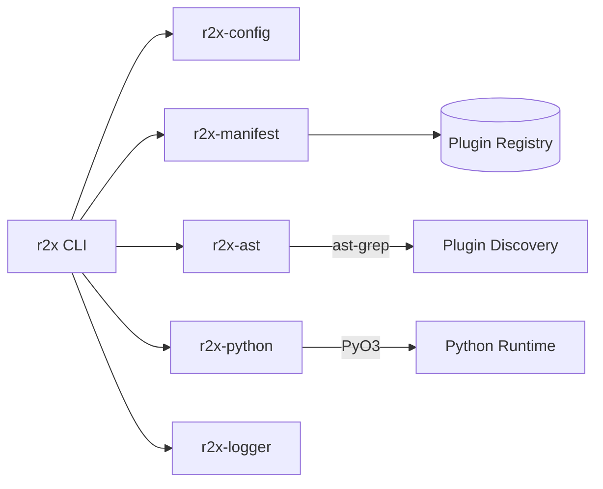

# r2x

> A plugin manager and pipeline runner for the r2x power systems
> modeling ecosystem. Install plugins, compose pipelines, run
> translations.

[](https://github.com/NatLabRockies/r2x-cli/actions/workflows/build.yml)
[](https://github.com/NatLabRockies/r2x-cli/actions/workflows/release.yml)
[](./LICENSE.txt)

## Table of Contents

* [Install](#install)
* [Quickstart](#quickstart)
* [Plugin Management](#plugin-management)
* [Running Pipelines](#running-pipelines)
* [Running Plugins Directly](#running-plugins-directly)
* [Interactive System Shell](#interactive-system-shell)
* [Configuration](#configuration)
* [Pipeline File Format](#pipeline-file-format)
* [Verbosity](#verbosity)
* [Architecture](#architecture)
* [Building from Source](#building-from-source)
* [License](#license)

## Install

Download the latest binary for your platform from the
[releases page](https://github.com/NatLabRockies/r2x-cli/releases/latest).

Installers are available for macOS, Linux (glibc 2.28+), and Windows:

```bash
# macOS / Linux
curl --proto '=https' --tlsv1.2 -LsSf https://github.com/NatLabRockies/r2x-cli/releases/latest/download/r2x-installer.sh | sh
```

```powershell
# Windows
powershell -ExecutionPolicy Bypass -c "irm https://github.com/NatLabRockies/r2x-cli/releases/latest/download/r2x-installer.ps1 | iex"
```

> [!NOTE]
> Pre-built binaries require Python shared libraries at runtime.
> If `r2x --version` fails with a missing `libpython` error, run
> `uv python install 3.12` to make the shared library available.

Verify it works:

```bash
r2x --version
```

## Quickstart

```bash
# 1. Initialize a pipeline config
r2x init

# 2. Install a plugin from PyPI
r2x install r2x-reeds

# 3. Run a pipeline
r2x run pipeline.yaml reeds-test
```

`r2x init` creates a `pipeline.yaml` with example variables, pipeline
definitions, and plugin configuration. Edit it to match your data and
you're running translations in under a minute.

## Plugin Management

| Command | What it does |
|:--------|:-------------|
| `r2x install <package>` | Install from PyPI |
| `r2x install NatLabRockies/r2x-reeds` | Install from a GitHub repo |
| `r2x install --branch dev NatLabRockies/r2x-reeds` | Install a specific branch (also `--tag`, `--commit`) |
| `r2x install -e /path/to/plugin` | Install in editable mode for local development |
| `r2x remove <package>` | Uninstall a plugin |
| `r2x list` | List all installed plugins |
| `r2x list r2x-reeds` | Filter by package name |
| `r2x list r2x-reeds break-gens` | Filter by package and module |
| `r2x sync` | Re-run plugin discovery |
| `r2x clean -y` | Wipe the plugin manifest |

## Running Pipelines

Pipelines chain plugins together in a named sequence defined in a YAML
file. See [Pipeline File Format](#pipeline-file-format) for the full
spec.

```bash
# List available pipelines
r2x run pipeline.yaml --list

# Dry run (preview without executing)
r2x run pipeline.yaml my-pipeline --dry-run

# Execute
r2x run pipeline.yaml my-pipeline

# Execute and save output
r2x run pipeline.yaml my-pipeline -o output.json
```

## Running Plugins Directly

Skip the pipeline and run a single plugin with inline arguments:

```bash
r2x run plugin r2x-reeds.reeds-parser solve_year=2030 weather_year=2012
```

```bash
# Show a plugin's help
r2x run plugin r2x-reeds.reeds-parser --show-help

# List all runnable plugins
r2x run plugin
```

## Interactive System Shell

Load a system JSON and drop into an IPython session for exploration:

```bash
r2x read system.json
```

```bash
# From stdin
cat system.json | r2x read

# Run a script against the system
r2x read system.json --exec script.py

# Run a script then stay interactive
r2x read system.json --exec script.py -i
```

The session exposes `sys` (the loaded system), `plugins` (installed
plugins), and lazy-loaded `pd`, `np`, `plt` for pandas, numpy, and
matplotlib. Type `%r2x_help` for the full list of magic commands.

## Configuration

```bash
# Show current config
r2x config show

# Set values
r2x config set python-version 3.13
r2x config set cache-path /path/to/cache

# Reset everything
r2x config reset -y
```

<details>
<summary>Python and virtual environment management</summary>

```bash
# Install a Python version
r2x config python install 3.13

# Get the Python executable path
r2x config python path

# Create or recreate the managed venv
r2x config venv create -y

# Install packages into the managed venv
uv pip install <package> --python $(r2x config python path)
```

</details>

<details>
<summary>Cache management</summary>

```bash
r2x config cache clean
```

</details>

## Pipeline File Format

Pipeline configs are YAML files with three sections: `variables` for
substitution values, `pipelines` for named plugin sequences, and
`config` for per-plugin settings.

```yaml
variables:
  output_dir: "output"
  reeds_run: /path/to/reeds/run
  solve_year: 2032

pipelines:
  reeds-test:
    - r2x-reeds.parser
    - r2x-reeds.break-gens

  reeds-to-plexos:
    - r2x-reeds.upgrader
    - r2x-reeds.parser
    - r2x-reeds-to-plexos.translation
    - r2x-plexos.exporter

config:
  r2x-reeds.parser:
    weather_year: 2012
    solve_year: ${solve_year}
    path: ${reeds_run}

  r2x-reeds.break-gens:
    drop_capacity_threshold: 5

  r2x-plexos.exporter:
    output: ${output_dir}

output_folder: ${output_dir}
```

Variables use `${var}` syntax and are substituted at runtime across
all `config` values and `output_folder`.

## Verbosity

| Flag | Effect |
|:-----|:-------|
| `-q` | Suppress informational logs |
| `-qq` | Suppress logs and plugin stdout |
| `-v` | Debug logging |
| `-vv` | Trace logging |
| `--log-python` | Show Python logs on console |

## Architecture



The workspace is split into six crates:

| Crate | Role |
|:------|:-----|
| `r2x-cli` | CLI entry point, command routing, pipeline execution |
| `r2x-config` | Configuration management, paths, Python/venv settings |
| `r2x-manifest` | Plugin manifest read/write, package metadata |
| `r2x-ast` | AST-based plugin discovery via ast-grep (no Python startup needed) |
| `r2x-python` | PyO3 bridge for running Python plugins |
| `r2x-logger` | Structured logging with tracing |

> [!TIP]
> Plugin discovery uses static analysis (ast-grep) instead of
> importing Python modules. This makes `r2x sync` and `r2x install`
> fast and safe, with no side effects from plugin code.

## Building from Source

### Prerequisites

* Rust toolchain ([rustup](https://rustup.rs/))
* [uv](https://docs.astral.sh/uv/) package manager
* Python 3.11, 3.12, or 3.13

```bash
# Install prerequisites
curl --proto '=https' --tlsv1.2 -sSf https://sh.rustup.rs | sh
curl -LsSf https://astral.sh/uv/install.sh | sh
uv python install 3.12
```

> [!IMPORTANT]
> Restart your shell after installing rustup and uv so both are
> available in your PATH.

### Build and install

```bash
git clone https://github.com/NatLabRockies/r2x-cli && cd r2x-cli
PYO3_PYTHON=$(uv python find 3.12) cargo install --path crates/r2x-cli --force --locked
```

This places the `r2x` binary in `~/.cargo/bin/`.

```bash
r2x --version
```

<details>
<summary>Manual build (custom install path)</summary>

```bash
PYO3_PYTHON=$(uv python find 3.12) cargo build --release
```

The binary lands at `target/release/r2x`. Copy it wherever you like.

</details>

<details>
<summary>Troubleshooting</summary>

* If the build fails with a Python error, verify `uv python find 3.12`
  returns a valid path. You may need `uv python install 3.12` first.
* If `r2x` is not found after install, check that `~/.cargo/bin` is in
  your `$PATH`.
* On HPC systems with older glibc, building from source is usually
  required since pre-built binaries target glibc 2.28+.

</details>

## License

BSD-3-Clause. See [LICENSE.txt](./LICENSE.txt) for the full text.

Copyright (c) 2025, Alliance for Sustainable Energy LLC.
