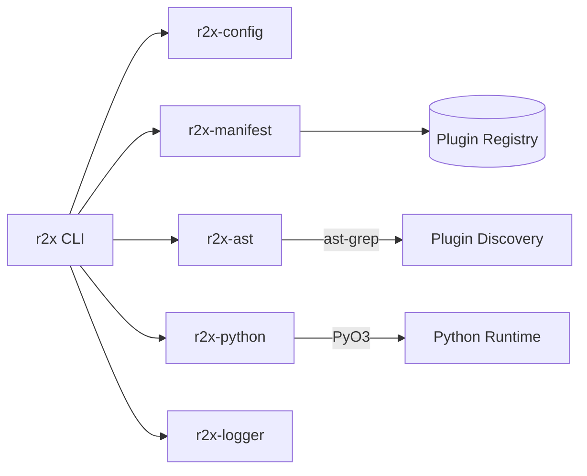

<h1 align="center">r2x</h1>
<p align="center">
Plugin manager and pipeline runner for the r2x<br>
power systems modeling ecosystem.
</p>

<div align="center">

[](https://github.com/NatLabRockies/r2x-cli/actions/workflows/build.yml)
[](https://github.com/NatLabRockies/r2x-cli/actions/workflows/release.yml)
[](./LICENSE.txt)

</div>

<p align="center">
<a href="#installation">Installation</a> · <a href="#upgrading">Upgrading</a> · <a href="#quick-start">Quick Start</a> · <a href="#plugin-management">Plugins</a> · <a href="#running-pipelines">Pipelines</a> · <a href="#interactive-system-shell">Shell</a> · <a href="#architecture">Architecture</a> · <a href="#ecosystem">Ecosystem</a> · <a href="#building-from-source">Source</a> · <a href="#license">License</a>
</p>

---

The `r2x` CLI is the orchestrator for the
[r2x](https://github.com/NatLabRockies/R2X) ecosystem. It
discovers installed Python plugins, chains them into pipelines,
and manages Python environments, all from a single Rust binary.

Plugins handle every step of a power systems translation workflow:
parsing source models, applying transforms, translating between
formats, and exporting to targets like PLEXOS or Sienna. The CLI
finds them via static analysis (no Python import side effects),
resolves their dependencies, and pipes each step's output into
the next.

## Installation

Download the latest binary from the
[releases page](https://github.com/NatLabRockies/r2x-cli/releases/latest),
or use the one-liner installers below.

### macOS / Linux

```bash
curl --proto '=https' --tlsv1.2 -LsSf \
  https://github.com/NatLabRockies/r2x-cli/releases/latest/download/r2x-installer.sh | sh
```

### Windows

```powershell
powershell -ExecutionPolicy Bypass -c "irm https://github.com/NatLabRockies/r2x-cli/releases/latest/download/r2x-installer.ps1 | iex"
```

Verify it works:

```bash
r2x --version
```

> [!NOTE]
> Pre-built binaries require Python shared libraries at runtime.
> If `r2x --version` fails with a missing `libpython` error, run
> `uv python install 3.12` to make the shared library available.

## Upgrading

If you installed via the shell/powershell installer, a standalone updater is included:

```bash
r2x-update
```

Alternatively, re-run the installer to get the latest version:

```bash
# macOS / Linux
curl --proto '=https' --tlsv1.2 -LsSf \
  https://github.com/NatLabRockies/r2x-cli/releases/latest/download/r2x-installer.sh | sh
```

## Quick Start

```bash
# 1. Scaffold a pipeline config
r2x init

# 2. Install a plugin from PyPI
r2x install r2x-reeds

# 3. See what got installed
r2x list

# 4. Run a pipeline
r2x run pipeline.yaml reeds-test
```

`r2x init` creates a `pipeline.yaml` with example variables,
pipeline definitions, and per-plugin configuration. Edit it to
match your data and you are running translations in under a
minute.

## Plugin Management

| Command | What it does |
| --- | --- |
| `r2x install <package>` | Install from PyPI |
| `r2x install gh:NatLabRockies/r2x-reeds` | Install from a GitHub repo |
| `r2x install gh:NatLabRockies/r2x-reeds --branch dev` | Install a specific branch (`--tag`, `--commit`) |
| `r2x install -e /path/to/plugin` | Install in editable mode for local dev |
| `r2x remove <package>` | Uninstall a plugin |
| `r2x list` | List all installed plugins |
| `r2x list r2x-reeds` | Filter by package name |
| `r2x list r2x-reeds break-gens` | Filter by package and module |
| `r2x sync` | Re-run plugin discovery and refresh manifest metadata |
| `r2x sync --upgrade` | Upgrade compatible installed plugins, then sync and show version/commit changes |
| `r2x clean -y` | Wipe the plugin manifest and clean cache |

> [!TIP]
> Plugin discovery uses static analysis (ast-grep) instead of
> importing Python modules. This makes `r2x sync` and
> `r2x install` fast and safe, with no side effects from plugin
> code.

## Running Pipelines

Pipelines chain plugins together in a named sequence defined in
a YAML file. See [Pipeline File Format](#pipeline-file-format)
for the full spec.

```bash
# List available pipelines
r2x run pipeline.yaml --list

# Dry run (preview without executing)
r2x run pipeline.yaml my-pipeline --dry-run

# Execute
r2x run pipeline.yaml my-pipeline

# Execute and save output
r2x run pipeline.yaml my-pipeline -o output.json
```

### Running Plugins Directly

Skip the pipeline and run a single plugin with inline arguments:

```bash
# Run a plugin directly
r2x run plugin r2x-reeds.reeds-parser solve_year=2030 weather_year=2012

# Show a plugin's help
r2x run plugin r2x-reeds.reeds-parser --show-help

# List all runnable plugins
r2x run plugin
```

### Pipeline File Format

Pipeline configs are YAML with three sections: `variables` for
substitution values, `pipelines` for named plugin sequences, and
`config` for per-plugin settings.

```yaml
variables:
  output_dir: "output"
  reeds_run: /path/to/reeds/run
  solve_year: 2032

pipelines:
  reeds-test:
    - r2x-reeds.reeds-parser
    - r2x-reeds.break-gens

  reeds-to-plexos:
    - r2x-reeds.reeds-parser
    - r2x-reeds-to-plexos.reeds-to-plexos
    - r2x-plexos.plexos-exporter

config:
  r2x-reeds.reeds-parser:
    weather_year: 2012
    solve_year: ${solve_year}
    path: ${reeds_run}

  r2x-reeds.break-gens:
    drop_capacity_threshold: 5

  r2x-plexos.exporter:
    output: ${output_dir}

output_folder: ${output_dir}
```

Variables use `${var}` syntax and are substituted at runtime
across all `config` values and `output_folder`.

## Interactive System Shell

Load a system JSON and drop into an IPython session for
exploration:

```bash
r2x read system.json
```

The session exposes `sys` (the loaded system), `plugins`
(installed plugins), and lazy-loaded `pd`, `np`, `plt` for
pandas, numpy, and matplotlib. Type `%r2x_help` for the full
list of magic commands.

<details>
<summary>Additional read options</summary>

```bash
# From stdin
cat system.json | r2x read

# Run a script against the system
r2x read system.json --exec script.py

# Run a script then stay interactive
r2x read system.json --exec script.py -i
```

</details>

## Configuration

```bash
# Show current config
r2x config show

# Set values
r2x config set python-version 3.13
r2x config set cache-path /path/to/cache

# Reset everything
r2x config reset -y
```

<details>
<summary>Python and virtual environment management</summary>

The `r2x python` command provides shortcuts for Python runtime management:

```bash
# Install a Python version
r2x python install 3.13

# Show installed Python versions
r2x python show

# Get the Python executable path
r2x python path

# Create or recreate the managed venv
r2x config venv create -y

# Install packages into the managed venv
uv pip install <package> --python $(r2x python path)
```

> [!TIP]
> The `r2x python` commands are shortcuts for `r2x config python <action>`.
> Both work identically.

</details>

<details>
<summary>Cache management</summary>

```bash
r2x config cache clean
```

</details>

<details>
<summary>Logging preferences</summary>

```bash
# Show current logging settings
r2x log show

# Keep Python/plugin stdout out of the log file by default
r2x log set no-stdout true

# Cap log file size (bytes)
r2x log set max-size 26214400

# Show Python log messages on console by default
r2x log set log-python true

# Override log file location
r2x log path /tmp/r2x.log

# Print the resolved log file path
r2x log path

# Command help
r2x log --help
r2x log set --help
```

</details>

> [!NOTE]
> Configuration is stored in `~/.config/r2x/config.toml` on Unix-like systems
> or `%APPDATA%\r2x\config.toml` on Windows. Override with the `R2X_CONFIG`
> environment variable.

## Verbosity

| Flag | Effect |
| --- | --- |
| `-q` | Suppress informational logs |
| `-qq` | Suppress logs and plugin stdout |
| `-v` | Debug logging |
| `-vv` | Trace logging |
| `--log-python` | Show Python logs on console |
| `--no-stdout` | Do not capture plugin stdout in logs |

Persisted logging defaults can be set with `r2x log set ...`.

## Architecture



The workspace is split into six crates:

| Crate | Role |
| --- | --- |
| `r2x-cli` | CLI entry point, command routing, pipeline execution |
| `r2x-config` | Configuration management, paths, Python/venv settings |
| `r2x-manifest` | Plugin manifest read/write, package metadata |
| `r2x-ast` | AST-based plugin discovery via ast-grep |
| `r2x-python` | PyO3 bridge for running Python plugins |
| `r2x-logger` | Structured logging with tracing |

## Ecosystem

The r2x ecosystem is a set of independently published packages.
The CLI orchestrates them; `r2x-core` provides the shared plugin
framework; model packages supply parsers, exporters, and data
models; and translation packages convert between formats.

| Package | Description |
| --- | --- |
| **r2x-cli** (this repo) | Rust CLI that discovers, installs, and runs any r2x plugin. Chains plugins into pipelines and manages Python environments |
| [r2x-core](https://github.com/NatLabRockies/r2x-core) | Shared plugin framework: `PluginContext`, `Rule`, `System`, `@getter` registry |
| [R2X](https://github.com/NatLabRockies/R2X) | Translation plugins: ReEDS to PLEXOS, Sienna to PLEXOS, and more |
| [r2x-reeds](https://github.com/NatLabRockies/r2x-reeds) | ReEDS parser, transform plugins, and component models |
| [r2x-plexos](https://github.com/NatLabRockies/r2x-plexos) | PLEXOS parser/exporter and component models |
| [r2x-sienna](https://github.com/NREL-Sienna/r2x-sienna) | Sienna parser/exporter and PowerSystems.jl-compatible models |
| [infrasys](https://github.com/NatLabRockies/infrasys) | Foundational `System` container, time series management, and component storage |
| [plexosdb](https://github.com/NatLabRockies/plexosdb) | Standalone PLEXOS XML database reader/writer |

## Building from Source

### Prerequisites

- Rust toolchain ([rustup](https://rustup.rs/))
- [uv](https://docs.astral.sh/uv/) package manager
- Python 3.11, 3.12, or 3.13

```bash
curl --proto '=https' --tlsv1.2 -sSf https://sh.rustup.rs | sh
curl -LsSf https://astral.sh/uv/install.sh | sh
uv python install 3.12
```

> [!IMPORTANT]
> Restart your shell after installing rustup and uv so both are
> available in your PATH.

### Build and install

```bash
git clone https://github.com/NatLabRockies/r2x-cli && cd r2x-cli
PYO3_PYTHON=$(uv python find 3.12) cargo install --path crates/r2x-cli --force --locked
```

This places the `r2x` binary in `~/.cargo/bin/`.

```bash
r2x --version
```

<details>
<summary>Manual build (custom install path)</summary>

```bash
PYO3_PYTHON=$(uv python find 3.12) cargo build --release
```

The binary lands at `target/release/r2x`. Copy it wherever you
like.

</details>

<details>
<summary>Development workflow</summary>

The project uses a `justfile` for common tasks:

```bash
just build     # fmt + clippy + build
just test      # cargo test --workspace --all-features
just lint      # fmt + clippy
just all       # fmt + clippy + test
```

</details>

<details>
<summary>Troubleshooting</summary>

- If the build fails with a Python error, verify
  `uv python find 3.12` returns a valid path. You may need
  `uv python install 3.12` first.
- If `r2x` is not found after install, check that `~/.cargo/bin`
  is in your `$PATH`.
- On HPC systems with older glibc, building from source is
  usually required since pre-built binaries target glibc 2.28+.

</details>

## License

BSD-3-Clause. See [LICENSE.txt](./LICENSE.txt) for the full text.

Copyright (c) 2025, Alliance for Sustainable Energy LLC.
